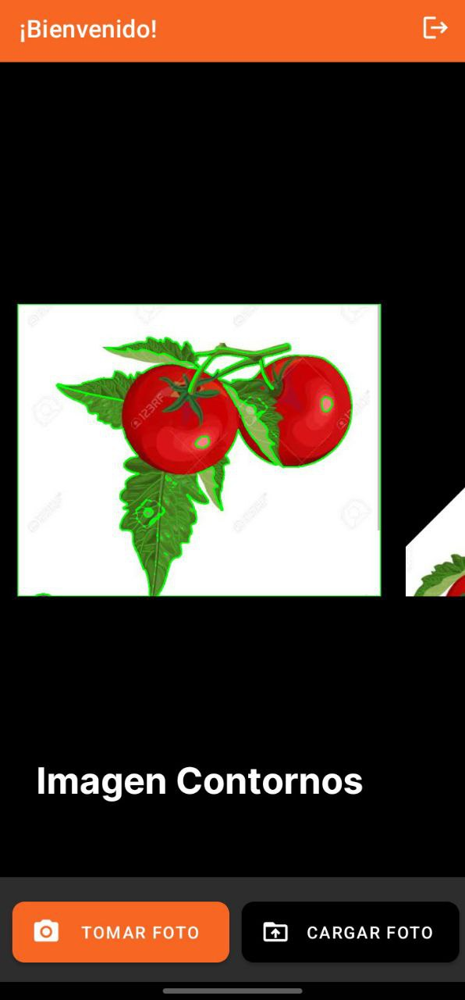

# Filtros con Opencv en Android
Esta es un aplicación móvil desarrollada en android con el lenguaje de programación kotlin, esta aplicacion aplica algunos filtros de esta liberia como convertir una imagen a escala de grises, separar la escala RGB, hacerla binaria, agregarle contornos, rotar la imagen o incluso escalarla; son muchas los aplicativos que se pueden hacer incluso procesar videos. 
## Ejemplos
En las imágenes siguientes se muestran mejor lo que hace la apliación móvil:
1. Imágen principal de la interfaz 

2. Imágen donde se carga una imagen a la interfaz 

3. Imágen procesada a escala de grises  

4. Imágen procesada a escala de rojo  

5. Imágen procesada a una imagen binaria  

6. Imágen procesada a los contornos  

3. Imágen Rotada

